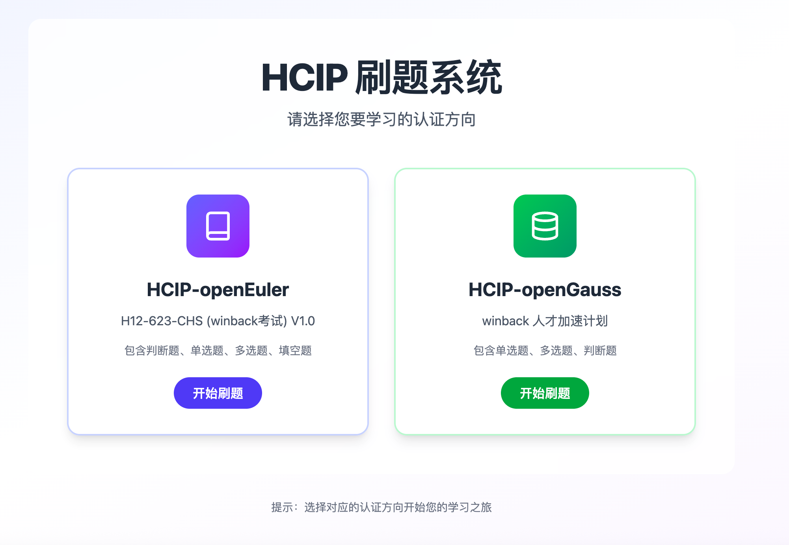

# HCIP-openEuler 刷题系统 包含HCIP-openGauss 题库

基于 React + TypeScript + Vite 构建的前端项目，已适配移动端，支持顺序/随机刷题、随机出题、进度条拖动跳题与显示答案。


## 启动开发环境

要求 Node.js 18+。

```bash
npm install
npm run dev
```

启动后访问：

- 主页：`http://localhost:5173/#/`
- 随机出题：`http://localhost:5173/#/random`
- 刷题模式：`http://localhost:5173/#/practice`

路由使用 Hash 模式（`/#/`），无需服务端重写，适合静态托管。

## 构建与本地预览

```bash
npm run build
npm run preview
```

预览默认地址：`http://localhost:4173/`。

## 常用脚本

- 开发：`npm run dev`
- 构建：`npm run build`
- 预览：`npm run preview`
- Lint：`npm run lint`
